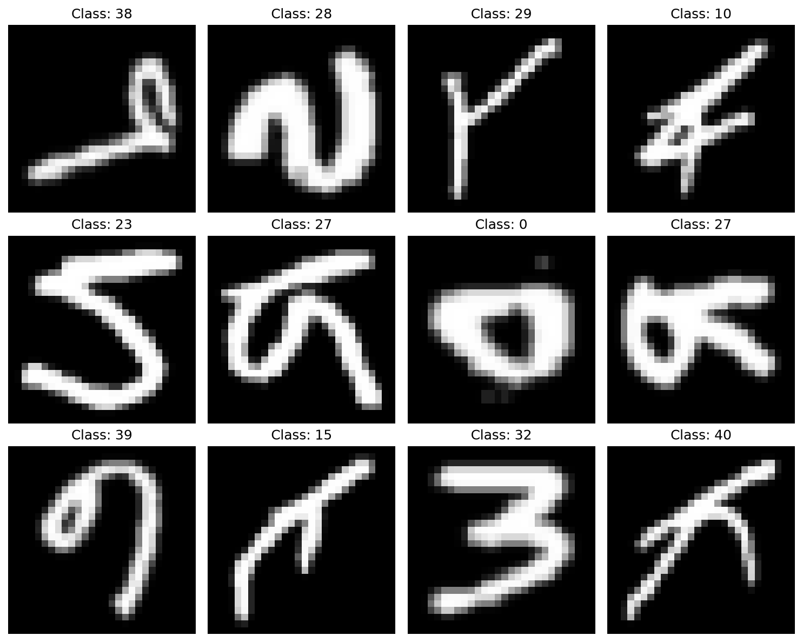
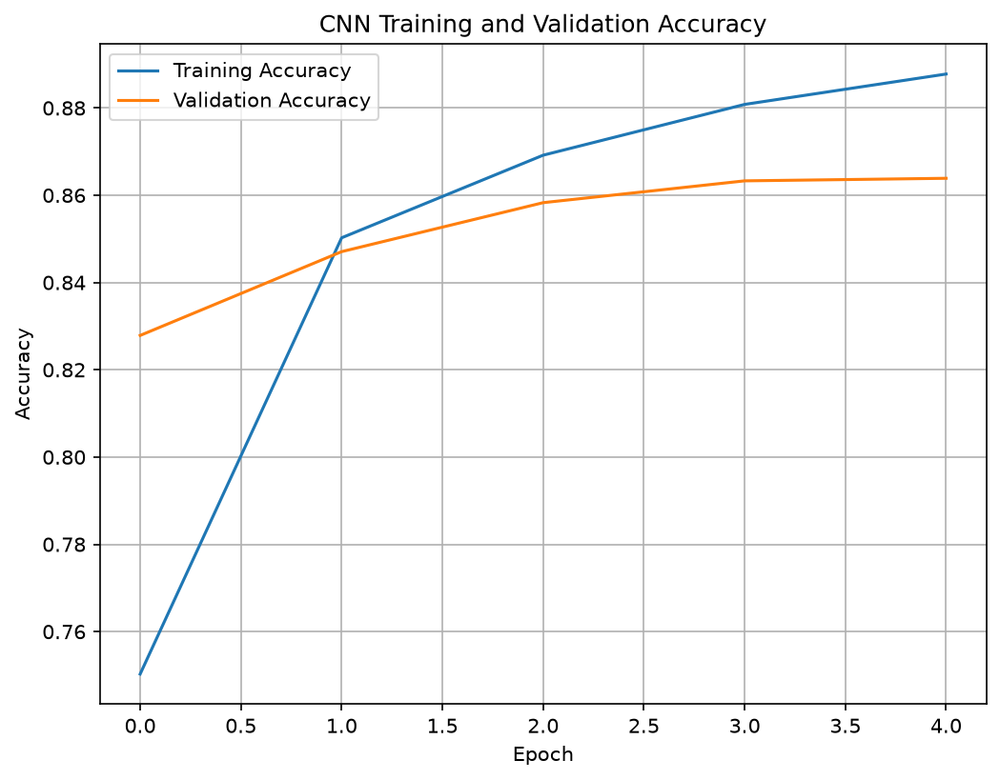
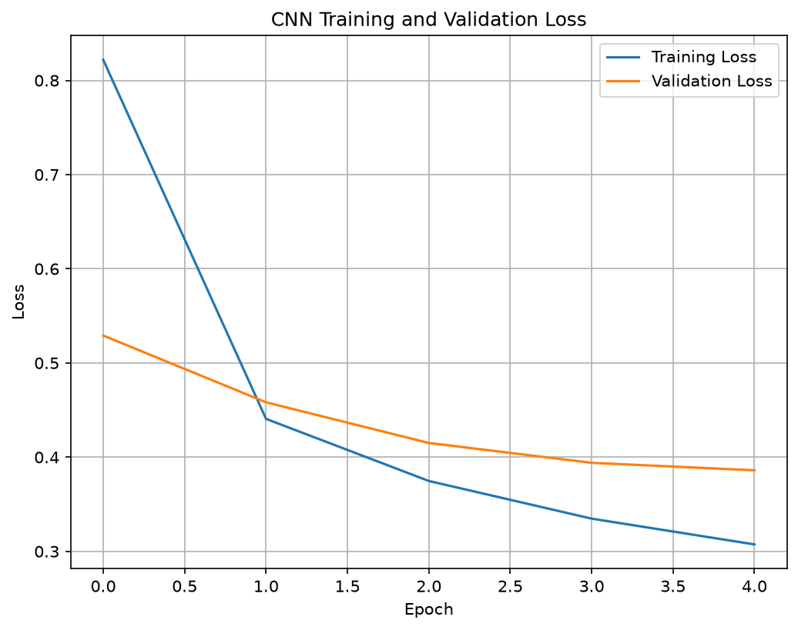
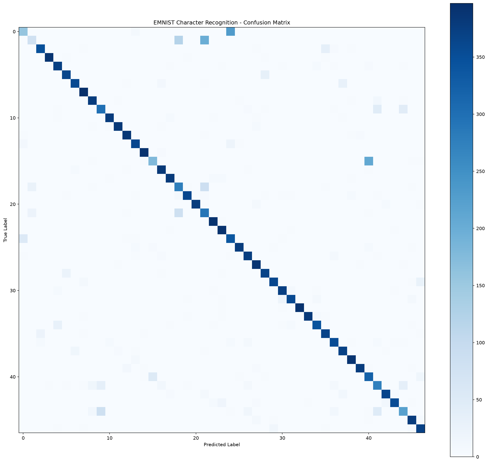
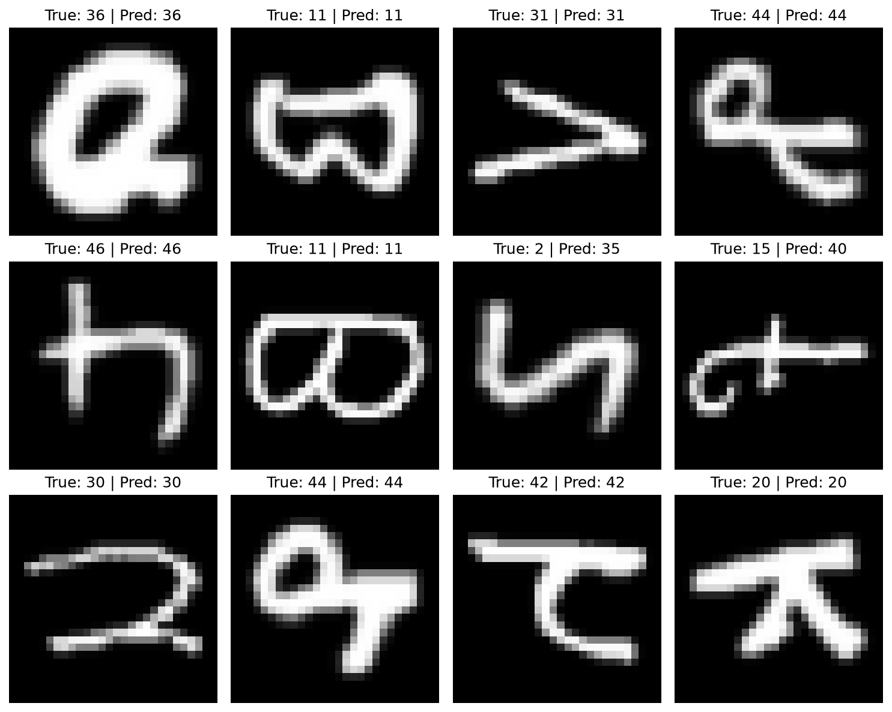

# Handwritten Character Recognition using CNN

## 📌 Project Overview

This project is a **Handwritten Character Recognition system** developed using **Deep Learning and Convolutional Neural Networks (CNNs)**.

The model is trained to recognize handwritten characters from images using the **EMNIST Balanced dataset**. It learns visual patterns such as edges, curves, shapes, and character structures and predicts which character is present in a given image.

This project was developed as part of the **CodeAlpha Machine Learning Internship**.

---

## 🎯 Objective

The main objectives of this project are:

* Recognize handwritten characters automatically from images.
* Use a Convolutional Neural Network (CNN) for image classification.
* Train the model using the EMNIST Balanced dataset.
* Evaluate the model using accuracy, loss, classification report, and confusion matrix.
* Visualize the model's training performance and predictions.
* Save the trained model for future use.

---

## 📊 Dataset

### EMNIST Balanced Dataset

The **EMNIST Balanced** dataset is a handwritten character dataset containing **47 different classes**.

The dataset used in this project contains:

| Dataset           |        Samples |
| ----------------- | -------------: |
| Training          |        112,800 |
| Testing           |         18,800 |
| Number of Classes |             47 |
| Image Size        | 28 × 28 pixels |

Each image represents a handwritten character.

The dataset is loaded using **TensorFlow Datasets (TFDS)**.

---

## 🧠 Model Architecture

A **Convolutional Neural Network (CNN)** is used for character classification.

The architecture consists of:

1. Convolutional Layer — 32 filters
2. Max Pooling Layer
3. Convolutional Layer — 64 filters
4. Max Pooling Layer
5. Flatten Layer
6. Fully Connected Dense Layer — 128 neurons
7. Output Layer — 47 neurons

The output layer uses the 47 classes of the EMNIST Balanced dataset.

### Model Parameters

The model contains approximately **229,807 trainable parameters**.

---

## ⚙️ Technologies Used

* Python
* TensorFlow
* Keras
* TensorFlow Datasets
* NumPy
* Matplotlib
* Scikit-learn

---

## 🔄 Project Workflow

```text
EMNIST Dataset
      ↓
Data Loading
      ↓
Image Preprocessing
      ↓
CNN Model Creation
      ↓
Model Training
      ↓
Model Evaluation
      ↓
Predictions
      ↓
Visualization
      ↓
Save Trained Model
```

---

## 🏋️ Model Training

The CNN model was trained for **5 epochs**.

During training, the model learns patterns from handwritten character images and improves its ability to classify unseen images.

Training performance is recorded using:

* Training Accuracy
* Validation Accuracy
* Training Loss
* Validation Loss

---

## 📈 Results

On the final test run, the model achieved:

**Test Accuracy: 86.39%**

**Test Loss: 0.3861**

The exact result can vary slightly between runs because neural-network training can involve random initialization and other sources of variation.

### Classification Performance

The final classification report produced approximately:

| Metric    | Macro Average | Weighted Average |
| --------- | ------------: | ---------------: |
| Precision |          0.87 |             0.87 |
| Recall    |          0.86 |             0.86 |
| F1-Score  |          0.86 |             0.86 |

---

## 📊 Visualizations

### Sample Characters

Example images from the EMNIST dataset:



### Training Accuracy

Training and validation accuracy during model training:



### Training Loss

Training and validation loss during model training:



### Confusion Matrix

The confusion matrix shows the classification performance across the 47 character classes:



### Prediction Examples

Examples of the model's predictions:



---

## 💾 Saved Model

The trained CNN model is saved in the `models` folder:

```text
models/
└── handwritten_character_cnn.keras
```

The saved model can be loaded later for making predictions without training the network again.

---

## 📁 Project Structure

```text
CodeAlpha_HandwrittenCharacterRecognition/
│
├── handwritten_character_recognition.py
│
├── models/
│   └── handwritten_character_cnn.keras
│
├── outputs/
│   ├── confusion_matrix.png
│   ├── prediction_examples.png
│   ├── sample_characters.png
│   ├── training_accuracy.png
│   ├── training_loss.png
│
└── README.md
```

---

## ▶️ How to Run

### 1. Clone the Repository

```bash
git clone https://github.com/1WT24CS031/CodeAlpha_MachineLearning.git
```

### 2. Navigate to the Project

```bash
cd CodeAlpha_MachineLearning/CodeAlpha_HandwrittenCharacterRecognition
```

### 3. Install Required Libraries

```bash
pip install tensorflow tensorflow-datasets numpy matplotlib scikit-learn
```

### 4. Run the Python Script

```bash
python handwritten
```
